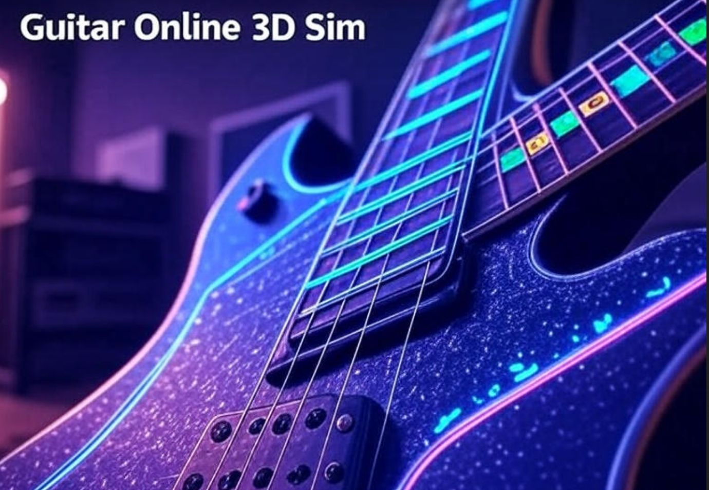

# 3d-guitar-online

https://pdragonlabs.github.io/3d-guitar-online/

3D Virtual Guitar Simulator
A web-based 3D guitar simulator built with Three.js and Tailwind CSS, allowing users to interact with a virtual guitar fretboard, mark and strum notes, play chords, and record sessions. The app features intuitive note visualization, a chord picker, and a responsive interface, making it ideal for guitar enthusiasts and learners.
Features

3D Fretboard Visualization: Interactive 3D guitar fretboard with note labels (e.g., "E", "G#") displayed as sprites, focusing on neck, strings, and tuning pegs.
Note and Chord Marking: Click to mark notes (red dots) on 3D/2D fretboards, supporting open (fret 0) and closed (fret > 0) notes. Chord positions are highlighted (green dots).
Strum and Play:
Strum: Play the current chord or manually set frets with the "Strum" button or Space key.
Strum Marked Notes: Play only marked notes in sequence, respecting open/closed states.
Roll-Over Strum: Hover over 3D strings in Fretboard Mode to strum individual notes.

Chord Picker: Dropdown to select and visualize chords on both 3D and 2D fretboards.
Fretboard Popup: Displays string, fret, and note (e.g., "String 1, Fret 3, G#") on hover in Fretboard Mode.
Lock/Recall Chords: Save custom fretboard states as chords and recall them via a dropdown.
Record and Playback: Record notes/chords and save them as playable recordings.
Save/Load: Export/import chords, locked chords, recordings, and marked notes as JSON.
Chord Editor: Rename, delete, or reorder chords via a drag-and-drop popup.
Piano Keys: Play simple piano notes for reference.
Responsive Design: Optimized for desktop and mobile with a clean, non-overlapping UI.
Accessibility: ARIA labels and Tab navigation for keyboard accessibility.
Error Handling: Robust try-catch blocks and alerts for user feedback.

Installation

Clone the Repository:
git clone https://github.com/your-username/3d-guitar-simulator.git
cd 3d-guitar-simulator

Serve the Application:

The app is a single HTML file (3d-guitar-strum-fixed.html) with no server-side dependencies.
Use a local web server for best results (e.g., to avoid CORS issues with file loading):npx http-server

Alternatively, open 3d-guitar-strum-fixed.html directly in a browser (Chrome, Firefox, Safari recommended).

Dependencies:

All dependencies (Three.js, OrbitControls, Tailwind CSS) are loaded via CDN, so no additional setup is required.

Usage

Open the App:

Navigate to http://localhost:8080/3d-guitar-strum-fixed.html (if using a local server) or open the HTML file directly in a browser.

Interact with the Fretboard:

Camera Mode: Use the mouse to rotate/zoom the 3D fretboard.
Fretboard Mode: Click "Toggle Mouse Mode" to switch. Click strings (open, fret 0) or frets (closed, fret > 0) to mark notes (red dots) and set currentFrets. Hover to see note details (e.g., "String 1, Fret 3, G#").
2D Fretboard: Click buttons to mark notes or set frets (blue for root, yellow for others).

Strum Notes/Chords:

Strum: Click "Strum" or press Space to play the current chord (if selected) or currentFrets. An alert appears if no playable notes are set.
Strum Marked Notes: Click "Strum Marked Notes" to play marked notes in sequence. An alert appears if none are marked.
Roll-Over Strum: In Fretboard Mode, hover over 3D strings to strum individual notes.

Chord Management:

Select Chord: Use the "Select Chord" dropdown to highlight chords (green dots) on 3D/2D fretboards.
Lock Chord: Set frets, click "Lock Chord", enter a name, and recall via "Recall Locked Chord" dropdown.
Save Chord: Save currentFrets as a named chord via "Save Chord".
Edit Chords: Click "Edit Chords" to rename/delete chords or drag buttons to reorder.

Record and Playback:

Check "Record", play notes/chords, then uncheck to save. A "Play #N" button appears for playback.
Click "Replay Notes" to play marked notes sequentially.
Click "Clear Notes" to reset marked notes.

Save/Load:

Click "Save All" to download a JSON file with chords, locked chords, recordings, and marked notes.
Click "Load All" to upload a JSON file and restore state.

Piano Keys: Click piano keys (C4–B4) for reference notes.

Controls:

Toggle Mouse Mode: Switch between Camera/Fretboard modes.
Space/Strum: Play chord or frets.
Esc: Clear chord/frets.
Tab: Navigate UI elements.

Screenshots
(Add screenshots here, e.g., using GitHub's image hosting. Example:)
Contributing
Contributions are welcome! To contribute:

Fork the repository.
Create a feature branch (git checkout -b feature/new-feature).
Commit changes (git commit -m 'Add new feature').
Push to the branch (git push origin feature/new-feature).
Open a pull request.

Please ensure code follows the existing style and includes error handling.
Issues
If you encounter bugs (e.g., runtime errors), check the browser console (F12) and report details in a GitHub issue. Include:

Browser and version
Error message
Steps to reproduce

Future Enhancements

Add real guitar audio samples for realistic sound.
Import a detailed GLTF guitar model.
Support MIDI export for recordings.
Customize marker colors or UI themes.

License
MIT License. See LICENSE for details.
Acknowledgments

Built with Three.js for 3D rendering.
Styled with Tailwind CSS.
Inspired by guitar learning tools and interactive music apps.

